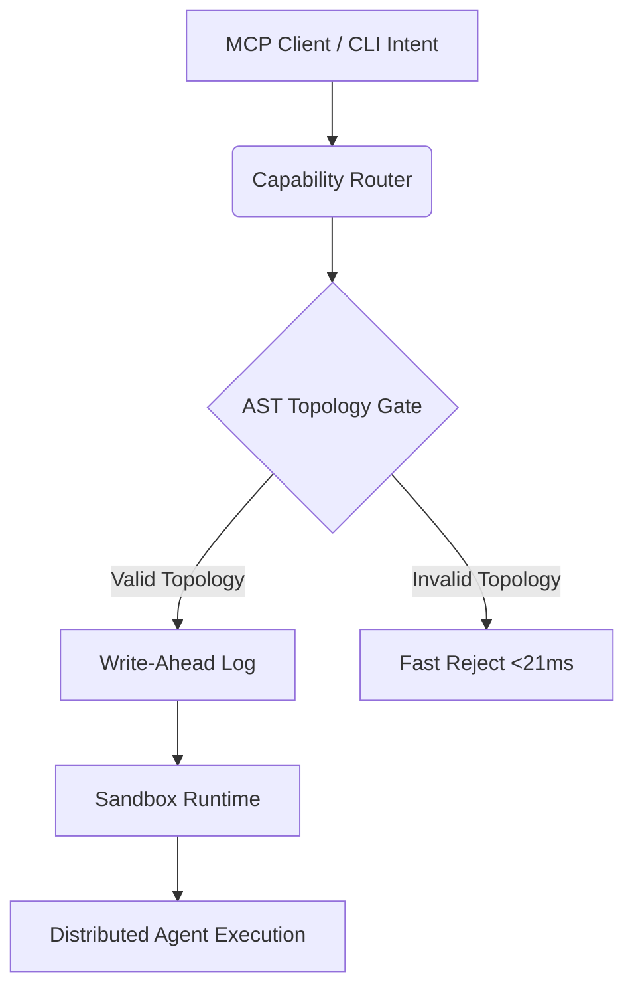

# Skillbrary: Distributed Swarm Toolkit

Skillbrary is an enterprise-grade, high-performance skill registry and execution layer designed for distributed multi-agent swarms. It enforces strict concurrency, low-latency execution (<100ms hardware budgets), and robust state synchronization using native Write-Ahead Logging (WAL) paradigms.

## Features

- **WAL-Driven Execution:** Uses `msvcrt` FileLock protocols to guarantee atomic file appending and state isolation across multiple agents without `os.fsync` latency blocks.
- **Lightweight AST Parsing:** Eliminates context bloat and Token blowout by parsing class and function topologies directly from the Abstract Syntax Tree. Includes a highly optimized Regex pre-filter (`FAST_REJECT_REGEX`) capable of parsing 850KB of code in ~21ms.
- **Topological DAG Execution:** A built-in Decompositor ensures all tasks are automatically sorted into a forward-moving Directed Acyclic Graph (DAG) for isolated, decoupled task routing.
- **Secure Sandbox Runtimes:** Executes tasks in natively branched workspaces with full environmental purges post-execution to prevent context cross-contamination.

## Architecture

## Project Structure

- `src/registry/wal_manager.py` - Core lock manager and WAL execution driver.
- `src/evaluator/ast_gate.py` - Optimized AST topography scanner.
- `src/router/capability_router.py` - Low-latency bulk action resolver.
- `src/runtime/sandbox.py` - Branch-based workspace isolation module.
- `src/main.py` - Unified CLI and MCP intent parser.

## Architecture Guidelines

- All operations must be strictly idempotent. 
- Direct master state mutation is forbidden; agents must submit Intents via the WAL.
- Hardware budgets strictly enforced: WAL appends < 10ms, Router IPC < 50ms, AST parsing < 100ms.
